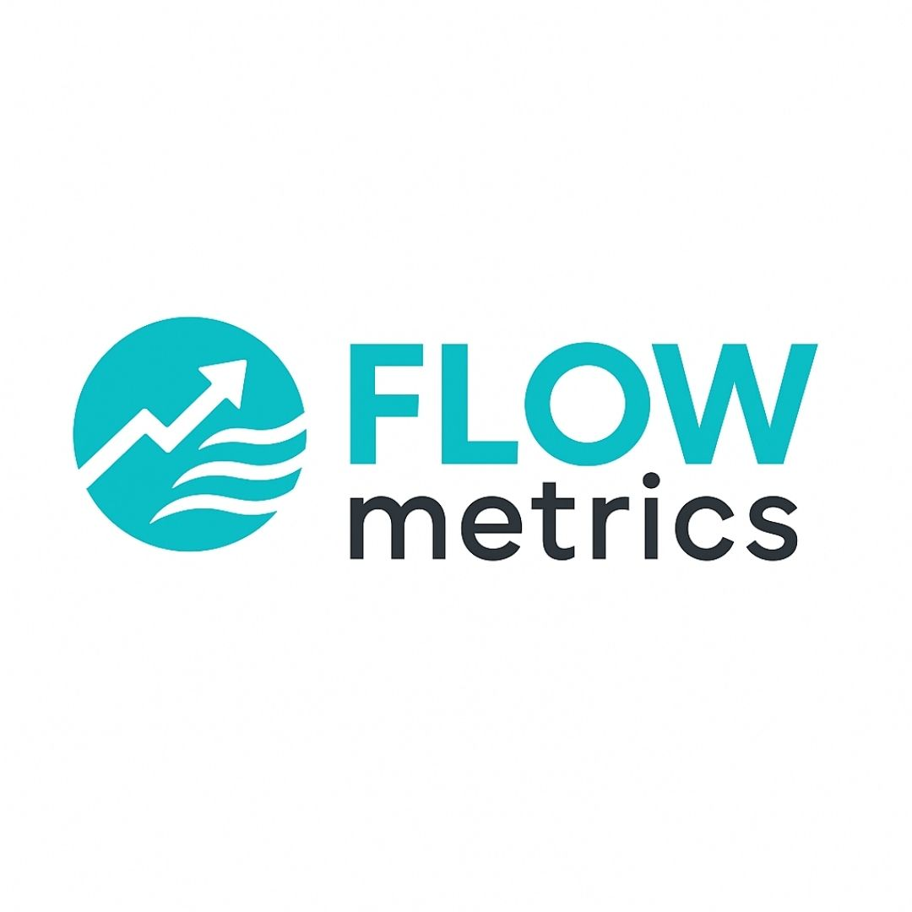

# FLOWmetrics



---

## 📈 FLOWmetrics: A New Standard for Valuing Utility Cryptocurrencies

FLOWmetrics is a comprehensive framework that redefines crypto valuation by anchoring it to **real economic activity**, not just speculative hype.

Inspired by the classical monetary equation of exchange (MV=PQ), FLOWmetrics adapts this to blockchain networks, producing an **entire suite of 42 metrics** that cover valuation, efficiency, liquidity, risk, volatility, and long-term forecasts.

---

## 🚀 What does this repository contain?

- ⚙️ The **FLOWmetrics Calculator**: a simple web tool (HTML/CSS/JS) that lets you enter:
  - Annual Settlement Volume (ASV)
  - Velocity
  - Effective Supply
  and instantly see the implied fair price, FLOW, Adjusted FLOW, and more.

- 📄 The **FLOWmetrics White Paper** (LaTeX & PDF):
  - Full explanation of the theory behind FLOWmetrics.
  - Detailed definitions of all 42 metrics, organized by category.
  - Example use cases for XRP and generic networks.

- 📝 The **FLOWmetrics Resources Markdown**:
  - Executive Summary
  - Top 5 Most Actionable Metrics for investors
  - Beginner Cheat Sheet for all 42 metrics, with plain explanations and analogies.

---

## 🔍 Why use FLOWmetrics?

**Traditional market cap is static and ignores utility.**  
It only multiplies price × circulating supply, without caring if the network actually moves money.

**FLOWmetrics fixes this by:**
- Calculating the foundational economic base (FLOW) needed to support the network’s transaction volume.
- Adjusting for liquidity buffers to ensure resilience.
- Generating a rich set of ratios, stress tests, and scenario forecasts to see if price is justified.

---

## 🚀 Quick core formulas

```
FLOW = ASV / Velocity
Adjusted FLOW = FLOW × (1 + Liquidity Buffer)
Price = Adjusted FLOW / Effective Supply
```

---

## 📚 How to get started

✅ **Try the calculator**  
Visit the GitHub Pages site at:  
```
https://futurexrp.github.io/FLOW-CALCULATOR/
```

Enter your own ASV, Velocity, and Supply to see how the fair price changes.

✅ **Read the white paper**  
For a full theoretical explanation, download:
- [FLOWmetrics White Paper (PDF)](FLOWmetrics_WhitePaper.pdf)
- Or see the source in LaTeX.

✅ **Check out the resources**  
- [FLOWmetrics Executive Summary, Top Metrics, and Beginner Cheat Sheet](FLOWmetrics_Resources.md)

---

## 🚀 How to use this repo

- Clone or download the repo to explore the calculator code.
- Edit the `index.html` if you’d like to customize it for your own tokens.
- Use the white paper and cheat sheets as due diligence tools for comparing crypto projects.

---

## 🛡 License & ownership

© 2025 Matthew Blair. All rights reserved.  
This repository and its contents are provided for educational and analytical purposes only.

---

Enjoy exploring true crypto fundamentals with FLOWmetrics! 🚀

